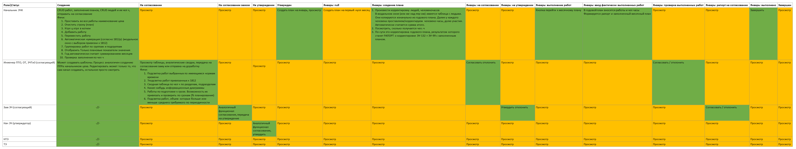

# Цифровой ППР. Описание задачи

## Процесс составления планов

Ежегодно в каждом предприятии составляются планы выполнения планового-предупредительных работ (далее Годовые планы).
Выглядят они как перечень работ, которые необходимо выполнить в течении года и сколько времени это займет. В Годовом плане всё расписано на каждый месяц.

В этих планах помимо непосредственно обслуживания устройств электроснабжения содержаться различные организационные мероприятия (например, прохождение работниками медицинских осмотров, организация технической учебы).

Первым делом при планировании считается сколько вообще человеко-часов есть (сколько рабочего времени работник отработает) с разбивкой по месяцам.

Далее по каждому разделу разбиваются объемы работ так, чтобы работники были способны его выполнить.

Когда начальник цеха подготовил Годовой план его проверяет инженер тех отдела, нормировщик (инженер по труду и заработной плате), инженер по охране труда, согласует заместитель начальника и утверждает начальник дистанции.

Ежемесячно начальник подразделения составляет ведомость работ на следующий месяц (далее Месячный план). Составляется он на основе Годового плана с учётом невыполненных ранее работ (например работа была не выполнена в марте и перенесена на май или же июнь).
Эти планы проверяет инженер тех отдела, нормировщик, утверждает заместитель начальника.
По завершению месяца в Месячном плане и в Годовом плане ставится отметка об объеме выполненных работ, затраченном времени. Если были выполнены работы вне плана, то они дополнительно прописываются. Делается это зачастую вручную.
Потом печатается/пишется рапорт о невыполненных позициях (что не сделали, в каком объеме, сколько времени на выполнение этой работы нужно было, и почему не выполнили).
Самим начальникам

Задача инженера проверить не наврал ли ему начальник цеха (по ошибке или злому умыслу). При этом не регламентируется как именно должен проверять. И в общем случае паралельно начальнику цеха заполняются годовые планы, сверяются данные по выполнению годовых планов, месячных, рапорта о не выполненных работах.

В вышестоящей структуре тоже должны проверять нас, также это нерегламентировано. По этому какую ответную форму придумают, такой мы и будет отчитываться. Сейчас это заполнить таблицу по затраченному времени на выполнение работ и письменный доклад с перечислением того, что не сделано.

## Проблема

В зависимости от ответственности начальника, его понимания порядка действий, способностями даже просто печатать в ворде, добавить/скрыть строку в ексель на выходе имеем информацию, в которой надо сидеть, пытаться в ней разобраться, обработать.

Помимо бумажной волокиты уже имеется несколько систем автоматизированного планирования, но в них начальники подразделений либо ничего не делают, либо проставляют значения "от фонаря": лишь бы по итоговым трудозатратам/часам цифры были нормальные. Эти автоматизированных системы не упрощают жизнь, не дополняют, а тем более не заменяют работу с бумажной документаций.

## Чего хотелось бы добиться

Для начальников цехов:

- Автоматизировать составление годовых, месяных планов, рапортов по установленным формам, внесение данных выполнения. Тем самым уменьшить затраты времени на их заполнение;
- Подготовка ланов, рапортов, их печать
- Снизить вероятность возникновение ошибок при переносе информации из одного плана в другой, данных о выполнении работ (они ведь дублируются), данных о перенесенных работах.
- Интерфейс должен быть настолько простой, но при этом гибким на добавление/исправление данных. Интерфейс такой, чтобы даже креветка справилась.

Для руководителей дистанции, тех отдела (мое место):

- Согласовывать, утверждать планы.
- Просмотр сводных данных, аналитических таблиц, диаграмм. Крч, смотрят кто, что выполнил, в каком объеме. Например, у нас 14 подразделений. Есть одна сводная таблица с работами и объемами запланированного и выполненного. Нажимаешь мышкой на какие-то позиции и показывается кто что сделал.

Для руководителей выше нас:

- Тоже просто смотрят. Например имеется у них сводная таблица по всем работам по структурам сродни нашей. Нажатием мышки руководител идёт и ищет не выполняющие план цеха, лишает всех премии и думает о том, какой он хороший манагер.
- В общем, наблюдает всякие аналитические справки, данные, таблицы, диаграммы

## Процесс планирования месячного плана выглядит следующим образом:

1. Начальника подразделения на основе Годового плана и предыдущих рапортов о переносе невыполненных позиций планирует Месячный план. Для этого он вручную в ексель документы выбирает нужные работы, скрывая строчки с ненужными, затем проставляет объемы. Отправляет инженера на проверку.
2. Инженер технического отдела проверят заполненный план также на основе годового плана (необходимо просмотреть глазами сотни позиций) и предыдущих рапортов о переносе невыполненных позиций. Передает на утверждение руководителю дистанции.
3. Начальник подразделения вручную заполняет выполнение работ в утвержденном месячном плане. Далее должен составить в word документе рапорт о переносе невыполненных позиций (указать какие именно работы не выполнены, в каком объеме и какие требуется трудозатраты для их выполнения. Также начальник подразделения заполняет Годовой план в графах выполнения.
4. Инженер технического отдела проверяет фактически выполненные работы, проверяет правильность написания рапорта, и также вручную заполняет имеющуюся на руках копию Годового плана для контроля выполнения работ.

Таким образом главным источником всей информации является Годовой план, на основании которой строится вся остальная документация.

## Матрица ролей и их возможностей в зависимости от статуса ППРа

# ТЕХ ДОЛГ:

1. При добавлении новой работы не создаю id. Также не проверяю, что добавил.
2. Добавлять новую работу надо по-другому (зная место, куда вставлять)

# ИДЕИ И ВОПРОСЫ:

1. Где хранить месячные планы и рапорта?
2. Сбоку также добавить раздел "НА СОГЛАСОВАНИИ", "НА УТВЕРЖДЕНИИ". Или же колокольчик, в котором будут приходить уведомления
3. Нажатием на enter, нажатием на стрелочки переключать фокус на следующий инпут
4. Не отрисовывать нули и пустые значения в таблице
5. Хранить пересчет итоговых значений нужно сразу в хранилище данных. Не нужно пересчитывать каждый раз эти данные, а только когда меняются. Плюс не стоит для каждой таблицы делать свои функции для расчета итоговых значений. Также это важно для формирования общих отчетов - не будешь же каждый раз по всей России в каждый ППР залазить и считать настой часов, процент и объемы выполнения работ и т.д. Нужно хранить промежуточные вычисления
6. История изменений, также всякие подсказки на подобие "уверены, что хотите удалить?"
7. Вынести настройки внешнего вида таблицы ППР в модальное окно или попап. Открываются настройки с помощью шестеренки в панеле управления
8. Валидация данных в инпутах
9. инпуты соответствуют типам данных (например, числовой инпут для числовых типов данных) (возможно стоит попробовать использовать инпуты ant и возможно с помощью них внедрить валидацию)
10. проверку на возможность корректировки/согласования/утверждения перенсти на бэк???
11. При создании шаблона вопрос с тем, что копировать (только планы, план и факт, ничего)
13. Хорошенько обдумать статус ППРа "plan_on_correction". Сейчас это просто промежуточное звено, обозначающее, что ППР отклонили. Можно же сразу отклонить ППР и использовать для этого статуса иное понятие. Как раз таки для корректировки, для изменения.
14. Закрепить временные периоды сверху при скролле
15. Строка с чел.-ч в ППРе на самом верху для удобства планирования и расставления чел.-ч
16. Скопировать данные в столбец "фактические трудозатраты" из столбца "трудозатраты согласно норме времени"
17. Проверка введенных данных в целом по ППРу
18. Если настой часов запланированных работ больше или меньше на 1, чем имеющийся настой часов, то закрасить цифру с суммарными запланированными человеко-часами
19. Удалять работы из ППРа (на этапе создания)
20. Добавлять для работы новый объект/участок

# БАГИ:

1. При обновлении страницы ppr/:id происходит бесконечная перезапись контекста. Быть может избавиться от контектса? Данный баг только в дев режиме (вроде как)
2. По-моему как-то странно обновляется контекст с ППРами. Будто только после перезагрузки он начинает менять значения
